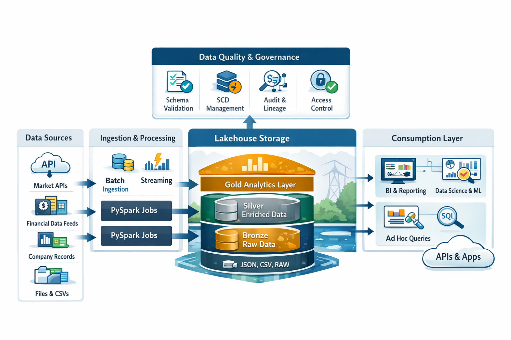

# End-to-End Metadata-Driven Lakehouse Pipeline (Databricks)

## Overview
This project implements a full **Bronze → Silver → Gold Lakehouse architecture**
using **Databricks, Delta Lake, and PySpark**.

It ingests data from:
- **Companies House (UK legal & regulatory data)**
- **Yahoo Finance (market & financial data)**

The pipeline is:
- Metadata-driven
- Incremental where required
- SCD Type 2 enabled
- Production-oriented

---

## Architecture

Raw Files (JSON / CSV)
↓
Bronze Layer (Raw + Schema Applied)
↓
Silver Layer (Cleaned, Enriched, SCD2)
↓
Gold Layer (Analytics & BI Ready)

---

## 📁 Folder Structure
```
end-to-end-ETL-pipeline/
│
├── main.py                       # Pipeline orchestrator
├── README.md
│
├── medallion/
│   ├── bronze/
│   │   ├── ds2b_company_house
│   │   ├── ds2b_yfinance
│   │   ├── config_company_house.json
│   │   └── yfinance.json
│   │
│   ├── silver/
│   │   ├── b2s_company_house
│   │   ├── b2s_yfinance
│   │   ├── config_company_house.json
│   │   └── config_yfinance.json
│   │
│   └── gold/
│       ├── s2g
│       └── config.json
│
└── utils/
├── logger.py
├── sparksession.py
├── schema.py
└── scd/
└── scd.py
```
---

## 🥉 Bronze Layer (Raw Ingestion)

### Companies House
- Reads nested JSON files
- Applies predefined schemas
- Explodes nested arrays (officers, filings)
- Adds ingestion metadata

Tables:
- `bronze.overview`
- `bronze.officers`
- `bronze.filing_history`

### YFinance
- Reads CSV files
- Applies strict schemas
- Handles malformed rows safely

Tables:
- `bronze.company_details`
- `bronze.fundamentals_data`
- `bronze.trading_data`

---

## 🥈 Silver Layer (Cleansed & Modeled)

### Company Master (Companies House)
- Joins overview, officers, and filing history
- Creates company-level aggregates
- Derives business attributes (age, activity status)

Table:
- `silver.company_master`

### YFinance SCD Type 2
- Hash-based change detection
- Composite business keys
- History preservation
- Structural & business validity checks

Tables:
- `silver.company_details`
- `silver.fundamentals_data`
- `silver.trading_data`

---

## 🥇 Gold Layer (Analytics Ready)

### Dimensions
- `gold.dim_company`
  - Market & financial identity (YFinance)
- `gold.dim_company_profile`
  - Legal & regulatory profile (Companies House)

### Facts
- `gold.fact_trading`
  - Daily trading metrics
- `gold.fact_fundamentals`
  - Quarterly financials
  - Derived KPIs:
    - QoQ revenue growth
    - EBITDA margin

Gold layer:
- Removes technical columns
- Uses current-state records only
- Optimized & Z-Ordered

---

## 🔁 Orchestration

The pipeline is orchestrated via a Python-based runner (`main.py`) that
executes each layer sequentially as standalone PySpark jobs.

Each layer exposes a `run(config_path)` entry point, enabling:
- Platform-agnostic execution (local, EMR, Dataproc, Databricks)
- Fail-fast execution
- Clear step-level logging
- Easy migration to schedulers (Airflow, Databricks Jobs, cron)
⸻

🔐 Data Quality & Governance

Implemented checks include:
- Non-null enforcement of business keys
- Numeric sanity checks on financial metrics
- Explicit schema enforcement at ingestion
- SCD Type 2 consistency using hash-based change detection
- Clear separation of business domains (legal vs market data)

⸻

🧠 Design Decisions (Interview Highlights)
- Separate company dimensions for different domains
- SCD Type 2 only where history matters
- Metadata-driven configs
- Defensive schema handling
- Gold layer is BI-only (no ingestion metadata)

⸻

## How to Run

1. Ensure Spark + Delta Lake are available
2. Update config file paths as required
3. Run individual layers or the full pipeline:

```bash
python main.py
```

Each pipeline stage can also be run independently using:

```
python <script_name>.py <config_path>
```
⸻

📈 Future Enhancements
- Data quality metrics table
- Unity Catalog tagging
- Incremental Gold refresh
- CI/CD integration

⸻

👤 Author

Ravindra Kumar
Data Engineer | PySpark | Databricks | Lakehouse

---
